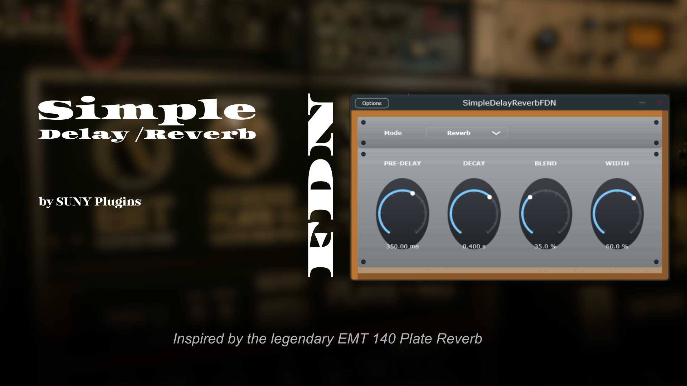
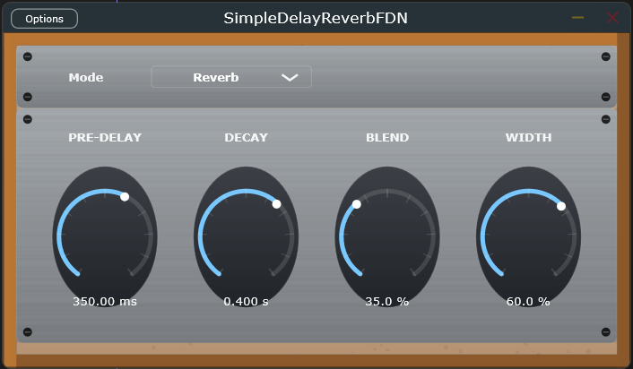

  

# SimpleDelayReverbFDN 🎛️

Un petit plugin **Delay / Reverb** développé avec **JUCE 8**.
Ce projet fait partie de la série de plugins *SUNY Plugins*.

---

# SimpleDelayReverbFDN 🎛️

---

## 🎧 Fonctionnalités

- Deux modes :
  - **Delay** : simple délai avec feedback et mix.
  - **Reverb** : reverb basique basée sur `juce::Reverb`.
- Interface graphique custom (look métallique + bois).
- 4 contrôles :
  - **PRE-DELAY** – temps du délai (ms)
  - **DECAY** – feedback (ou temps de décroissance)
  - **BLEND** – mix Wet/Dry
  - **WIDTH / ROOM SIZE** – taille de la pièce pour la reverb
- Compatible **VST3** (Windows x64)

---

## 🛠️ Compilation

### Prérequis :
- [JUCE 8+](https://juce.com)
- Visual Studio 2022 (C++ Desktop)
- SDK VST3 installé (inclus dans JUCE)

### Étapes :
1. Ouvre `SimpleReverbFDN.jucer` avec Projucer.
2. Exporte vers **Visual Studio 2022**.
3. Compile en mode **Release / x64**.
4. Le plugin `.vst3` est généré
